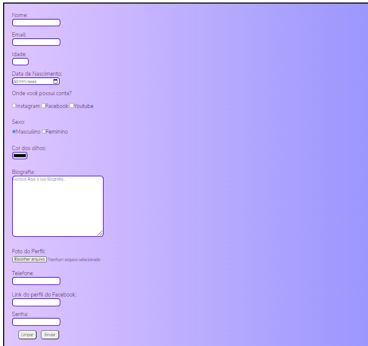

# Form

Formulário usando HTML e CSS para praticar as tecnologias

### Ajustes e melhorias

O projeto foi concluído e essas foram as tarefas: 

- [x] Estruturar com HTML
- [x] Estilizar com Css

## Link
<a href="https://matteusfrancadev.github.io/Form/" target="_blank"> Link do projeto</a>

## 🤝 Colaboradores

Agradecemos às seguintes pessoas que contribuíram para este projeto:

<table>
  <tr>
    <td align="center">
      <a href="#">
         
        
          <b>Matheus França</b>
        
      </a>
    </td>

  </tr>
</table>

[⬆ Voltar ao topo](#Form) 
